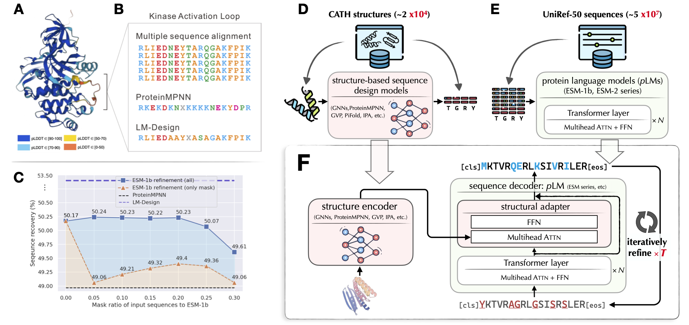

<!-- <div align="center"> -->

# ByProt

<a href="https://pytorch.org/get-started/locally/"></a>
<a href="https://pytorchlightning.ai/"></a>
<a href="https://hydra.cc/"></a>
<a href="https://github.com/ashleve/lightning-hydra-template"></a><br>
[](https://arxiv.org/abs/2302.01649)
<!-- [](https://papers.nips.cc/paper/2020) -->

<!-- </div> -->

<!-- ## Description -->


ByProt is a versatile toolkit designed for generative learning in protein research. It currently focuses primarily on structure-based sequence design (a.k.a., fixedbb), offering the following key features:

- **Efficient non-autoregressive ProteinMPNN variant:** 
ByProt provides an efficient and effective non-autoregressive variant of [ProteinMPNN](https://github.com/dauparas/ProteinMPNN), a powerful tool for protein fixed-backbone sequence design.
- **Official implementation of <span style="font-variant:small-caps;">LM-Design</span> :** 
ByProt serves as the official implementation of <span style="font-variant:small-caps;">LM-Design</span>, the state-of-the-art protein sequence design model from the paper titled **"Structure-informed Language Models Are Protein Designers,"** which was presented at ICML 2023 (oral). For more details, please refer to the [paper](https://arxiv.org/abs/2302.01649).



We are continuously expanding ByProt's capabilities to encompass a broader range of tasks and features. Stay tuned for updates as we strive to provide an even more comprehensive toolkit for protein research.


## Installation

```bash
# clone project
git clone --recursive https://url/to/this/repo/ByProt.git
cd ByProt

# create conda virtual environment
env_name=ByProt

conda create -n ${env_name} python=3.7 pip
conda activate ${env_name}

# automatically install everything else
bash install.sh
```

## Structure-based protein sequence design (inverse folding)


**Pretrained model weights**
| model                | training data | checkpoint |
|----------------------|------------|------------|
| `protein_mpnn_cmlm`    | cath_4.2   | [link](https://drive.google.com/file/d/1PlbOTgScB1vQ1E806wxXdKukmeCIuWxQ/view?usp=drive_link)       |
| `lm_design_esm1b_650m` | cath_4.2   | [link](https://drive.google.com/file/d/1II45fq8-1TDmtg3W43LMYsoyJfar0Avw/view?usp=sharing)       |
| `lm_design_esm2_650m`  | cath_4.2   | [link](https://drive.google.com/file/d/19jkupcgKyu1OZIKX1uQeAl0mmcwD6hIN/view?usp=drive_link)       |


### Data

**Download the preproceesd CATH datasets**
- CATH 4.2 dataset provided by [Generative Models for Graph-Based Protein Design (Ingraham et al, NeurIPS'19)](https://papers.nips.cc/paper/2019/hash/f3a4ff4839c56a5f460c88cce3666a2b-Abstract.html)
- CATH 4.3 dataset provided by [Learning inverse folding from millions of predicted structures (Hsu et al, ICML'22)](https://www.biorxiv.org/content/10.1101/2022.04.10.487779v1) 
```bash
bash scripts/download_cath.sh
```
Go check `configs/datamodule/cath_4.*.yaml` and set `data_dir` to the path of the downloaded CATH data. 

**Dowload PDB complex data (multichain)**

This dataset curated protein (multichain) complexies from Protein Data Bank (PDB). 
It is provided by [Robust deep learning-based protein sequence design using ProteinMPNN](https://www.biorxiv.org/content/10.1101/2022.06.03.494563v1). 
See their [github page](https://github.com/dauparas/ProteinMPNN/blob/main/training/README.md) for more details.
```bash
bash scripts/download_multichain.sh
```
Go check `configs/datamodule/multichain.yaml` and set `data_dir` to the path of the downloaded multichain data. 


OK we now get everything ready and can start to train a model. 

<!-- <br> -->


### Training
In the following sections, we will use CATH 4.2 dataset as an runing example. You can likewise build your models on the multichain dataset to accommodate protein complexies.


#### Example 1: Non-autoregressive (NAR) ProteinMPNN baseline

Training NAR ProteinMPNN with conditional masked language modeling (CMLM)

```bash
export CUDA_VISIBLE_DEVICES=0
# or use multi-gpu training when you want:
# export CUDA_VISIBLE_DEVICES=0,1

exp=fixedbb/protein_mpnn_cmlm  
dataset=cath_4.2
name=fixedbb/${dataset}/protein_mpnn_cmlm

python ./train.py \
    experiment=${exp} datamodule=${dataset} name=${name} \
    logger=tensorboard trainer=ddp_fp16 
```

Some flags for training:

| Argument              | Usage                                                                                                                           |
|-----------------------|---------------------------------------------------------------------------------------------------------------------------------|
| `experiment`          | experiment config. see `ByProt/configs/experiment/` folder                                                                      |
| `datamodule`          | dataset config. see `ByProt/configs/datamodule` folder                                                                          |
| `name`                | experiment name, deciding the directory path your experiment saving to, e.g., `/root/research/projects/ByProt/run/logs/${name}` |
| `logger`              | config of which ml experiment logger to use, e.g., tensorboard.                                                                 |
| `train.force_restart` | set to `true` to force retrain the experiment under `${name}`. otherwise will resume training from the last checkpoint.         |


#### Example 2: LM-Design

Training <span style="font-variant:small-caps;">LM-Design</span> upon ESM-1b 650M.
> Training would take approxmiately 6 hours on one A100 GPU. 
```bash
exp=fixedbb/lm_design_esm1b_650m
dataset=cath_4.2
name=fixedbb/${dataset}/lm_design_esm1b_650m

./train.py \
    experiment=${exp} datamodule=${dataset} name=${name} \
    logger=tensorboard trainer=ddp_fp16 
```


Building <span style="font-variant:small-caps;">LM-Design</span> upon ESM-2 series using `exp=fixedbb/lm_design_esm2*`. Please check `ByProt/configs/experiment/fixedbb`.


### Evaluation/inference on valid/test datasets
```bash
dataset=cath_4.2
# name=fixedbb/${dataset}/protein_mpnn_cmlm
name=fixedbb/${dataset}/lm_design_esm1b_650m
exp_path=/root/research/projects/ByProt/run/logs/${name}

python ./test.py \                                                                 
    experiment_path=${exp_path} \
    data_split=test ckpt_path=best.ckpt mode=predict \
    task.generator.max_iter=5
```

Some flags for generation

| Argument                             | Usage                                                                                                            |
|--------------------------------------|------------------------------------------------------------------------------------------------------------------|
| `experiment_path`                    | folder that saves experiment (.hydra, checkpoints, tensorboard, etc)                                             |
| `data_split`                         | `valid` or `test` dataset.                                                                                       |
| `mode`                               | `predict` for generating sequence & calculating amino acid sequence recovery; `test` for evaluation for nll, ppl |
|  | |
| `task.generator`                     | arguments for sequence generator/sampler                                                                         |
| - `max_iter=<int>`                   | maximum decoding iteration (default: `5` for LM-Design, `1` for ProtMPNN-CMLM)                                   |
| - `strategy=[denoise, mask_predict]` | decoding strategy. (default: `denoise` for LM-Design, `mask_predict` for ProtMPNN-CMLM)                          |
| - `temperature=<float>`              | temperature for sampling. set to 0 to disable for deterministic sampling (default: `0`)                          |
| - `eval_sc=<bool>`                   | additional evaluating scTM score using ESMFold. (default: `false`)                                               |

### Designing sequences from a pdb file using a trained model in Notebook

**Example 1: ProteinMPNN-CMLM**

```python
from byprot.utils.config import compose_config as Cfg
from byprot.tasks.fixedbb.designer import Designer

# 1. instantialize designer
exp_path = "/root/research/projects/ByProt/run/logs/fixedbb/cath_4.2/protein_mpnn_cmlm"
cfg = Cfg(
    cuda=True,
    generator=Cfg(
        max_iter=1,
        strategy='mask_predict',
        temperature=0,
        eval_sc=False,  
    )
)
designer = Designer(experiment_path=exp_path, cfg=cfg)

# 2. load structure from pdb file
pdb_path = "/root/research/projects/ByProt/data/3uat_variants/3uat_GK.pdb"
designer.set_structure(pdb_path)

# 3. generate sequence from the given structure
designer.generate()

# 4. calculate evaluation metircs
designer.calculate_metrics()
## prediction: SSYNPPILLLGPFAEELEEELVEENPERAGRPVPFTTEPPSPDETEGETYLYISSLEEAEELIESNRFLEAGEENNELVGISLEAIRSVARAGKLAILDTGGEAVEKLEEANIEPIVIFLVPKSVEDVRRVFPDLTEEEAEELTSEDEELLEEFKELLDAVVSGSTLEEVLEEIREVIEEASS
## recovery: 0.37158469945355194
```


**Example 2: <span style="font-variant:small-caps;">LM-Design</span>**

```python
from byprot.utils.config import compose_config as Cfg
from byprot.tasks.fixedbb.designer import Designer

# 1. instantialize designer
exp_path = "/root/research/projects/ByProt/run/logs/fixedbb/cath_4.2/lm_design_esm2_650m"
cfg = Cfg(
    cuda=True,
    generator=Cfg(
        max_iter=5,
        strategy='denoise', 
        temperature=0,
        eval_sc=False,  
    )
)
designer = Designer(experiment_path=exp_path, cfg=cfg)

# 2. load structure from pdb file
pdb_path = "/root/research/projects/ByProt/data/3uat_variants/3uat_GK.pdb"
designer.set_structure(pdb_path)

# 3. generate sequence from the given structure
designer.generate()
# you can override generator arguments by passing generator_args, e.g.,
designer.generate(
    generator_args={
        'max_iter': 5, 
        'temperature': 0.1,
    }
)

# 4. calculate evaluation metircs
designer.calculate_metrics()
## prediction: LNYTRPVIILGPFKDRMNDDLLSEMPDKFGSCVPHTTRPKREYEIDGRDYHFVSSREEMEKDIQNHEFIEAGEYNDNLYGTSIESVREVAMEGKHCILDVSGNAIQRLIKADLYPIAIFIRPRSVENVREMNKRLTEEQAKEIFERAQELEEEFMKYFTAIVEGDTFEEIYNQVKSIIEEESG
## recovery: 0.7595628415300546
```


## Acknowledgements
ByProt extends its gratitude to the following projects and individuals:

- [PyTorch Lightning](https://www.pytorchlightning.ai/) and [lightning-hydra-template](https://github.com/ashleve/lightning-hydra-template) for providing a robust foundation for our development process.

ByProt draws inspiration and leverages/modifies implementations from the following repositories:
- [jingraham/neurips19-graph-protein-design](https://github.com/jingraham/neurips19-graph-protein-design) for the preprocessed CATH dataset and data pipeline implementation.
- [facebook/esm](https://github.com/facebookresearch/esm/) for their ESM implementations, pretrained model weights, and data pipeline components like `Alphabet`.
- [dauparas/ProteinMPNN](https://github.com/dauparas/ProteinMPNN/) for the ProteinMPNN implementation and multi-chain dataset.
- [A4Bio/PiFold](https://github.com/A4Bio/PiFold) for their PiFold implementation.
- [jasonkyuyim/se3_diffusion](https://github.com/jasonkyuyim/se3_diffusion) for their self-consistency structural evaluation implementation.

We express our sincere appreciation to the authors of these repositories for their invaluable contributions to the development of ByProt.


## Citation
```python
@inproceedings{zheng2023lm_design,
    title={Structure-informed Language Models Are Protein Designers},
    author={Zheng, Zaixiang and Deng, Yifan and Xue, Dongyu and Zhou, Yi and YE, Fei and Gu, Quanquan},
    booktitle={International Conference on Machine Learning},
    year={2023}
}
```